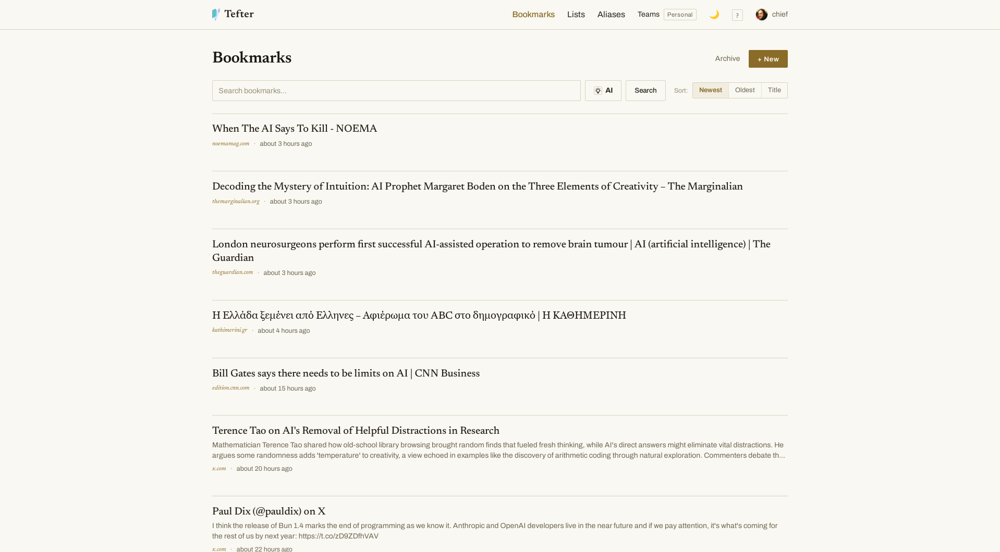

# Tefter Desktop

[tefter.io](https://tefter.io) in a desktop window, built with
[Tauri](https://tauri.app). It renders in your system's webview, so the app
stays as current as your OS — the lesson of its predecessor, a 2019
Electron build whose bundled Chromium aged out from under it.

External links open in your regular browser. The window remembers its size
and position. The app identifies itself as `tefter-desktop/<version>`.

See also our [command-line app](https://github.com/tefter/cli).



## Downloads

Grab the build for your platform from
[Releases](https://github.com/tefter/desktop/releases).

## Building

Prerequisites: [Rust](https://rustup.rs), Node.js, and on Linux the
[Tauri system dependencies](https://tauri.app/start/prerequisites/)
(`libwebkit2gtk-4.1-dev`, `libgtk-3-dev`, `build-essential`, `libssl-dev`,
`librsvg2-dev`).

```shell
npm install
npm run tauri build
```

The bundles land in `src-tauri/target/release/bundle/`. For development,
`npm run tauri dev` opens the window straight away.

## Releasing

Push a `v*` tag; the GitHub Actions workflow builds Linux, macOS and
Windows bundles and attaches them to a draft release.

## License

Copyright (c) [tefter.io](https://tefter.io), MIT License.
See [LICENSE.txt](LICENSE.txt) for further details.
